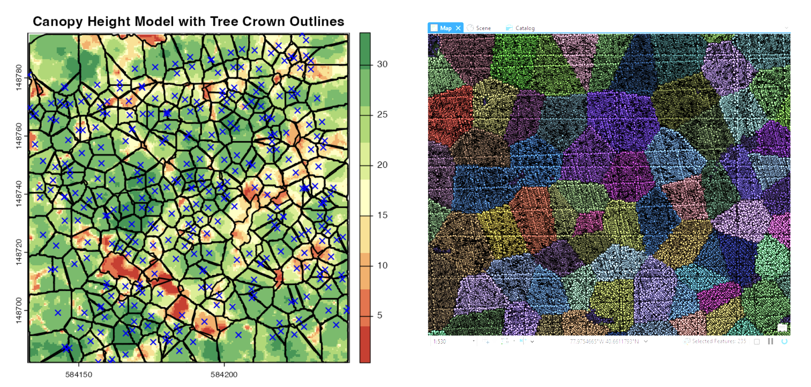
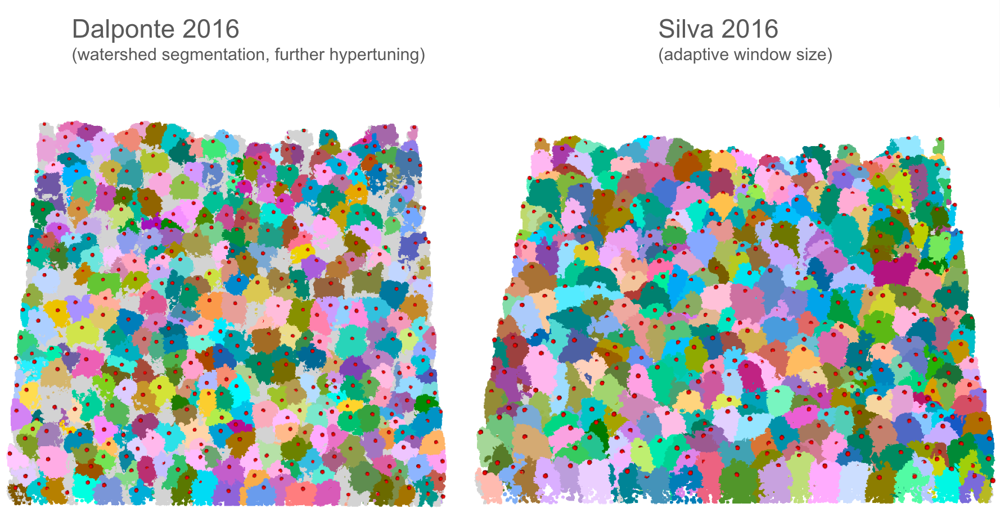

# Tree Species Segmentation & Classification with Deep Learning 

Tree species classification for Duke's Qiu SEEDS (Spatial Ecology and Environmental Data Sciences) Lab.  
Integrating hyperspectral, LiDAR, and ecological ground sampling data within a deep learning framework.

---

### Segmentation GUI Comparison

**GUI for comparing tree watershed segmentation methods (Dalponte 2016 vs. Silva 2016):**  
- **Left:** Blue crosses represent ground-truth tree trunk points; outlined polygons show predicted canopy structures.  
- **Right:** Visualization overlaid in ArcGIS for spatial reference.

---

### LiDAR Segmentation Comparison

**Tree segmentation results on LiDAR data:**  
- **Left:** Dalponte (2016) method  
- **Right:** Silva (2016) method
